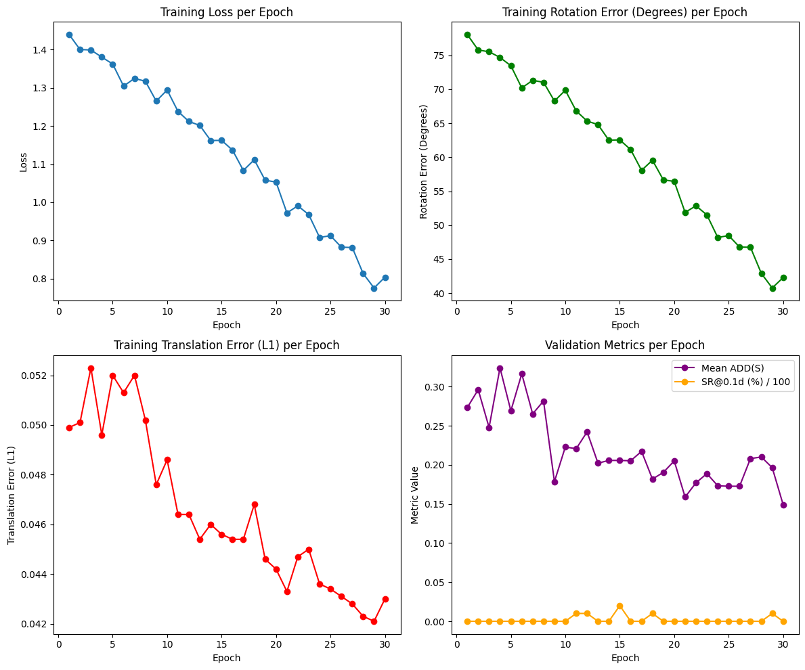

# 🧠 FormerPose: Transformer-based 6D Object Pose Estimation

## 📘 Overview

**FormerPose** is a deep learning model designed for **6D object pose estimation** — predicting an object’s 3D rotation and translation from RGB or RGB-D images.
The model leverages **transformer-based attention** mechanisms for robust spatial feature aggregation, improving over conventional CNN-based pose estimators.

This implementation focuses on **training and evaluating FormerPose** on the **LINEMOD** or **YCB-Video** dataset.

---

## ⚙️ Flow of Implementation

### **1. Environment Setup**

* Installed essential libraries:

  ```bash
  torch, torchvision, timm, einops, open3d, transforms3d, tqdm, opencv-python, scipy, matplotlib
  ```
* Verified GPU availability via `nvidia-smi`.

---

### **2. Dataset Download and Extraction**

* Downloaded **LINEMOD** dataset from Google Drive using `gdown`.
* Extracted dataset and organized folder structure for training and testing splits.
* Dataset includes RGB images, depth maps, and 3D object models.

---

### **3. Configuration Setup**

Defined training parameters in a config dictionary (`CFG`):

```python
CFG = {
    "data_root": "/content/data",
    "dataset": "linemod",
    "batch_size": 8,
    "num_workers": 4,
    "epochs": 30,
    "lr": 2e-4,
    "wd": 1e-4,
    "img_size": 480,
    "pc_n": 1000,
    ...
}
```

---

### **4. Utility Functions**

* **Transformation Helpers**:

  * Convert between rotation matrices, quaternions, and SE(3) transformations.
  * Back-project depth maps to 3D point clouds.
* **Evaluation Metrics**:

  * ADD-S metric for symmetric objects.
  * [SR@0.1d](mailto:SR@0.1d) success rate.

---

### **5. Dataset Class**

`LinemodDataset` handles:

* Loading RGB, depth, and mask images.
* Extracting valid 3D points.
* Normalizing and resizing images.
* Generating ground-truth pose labels `(R, t)`.

---

### **6. Model Architecture**

**FormerPose** is built using:

* **Depthwise separable convolutions (DWConv)** for efficient feature extraction.
* **Transformer Encoder blocks** for global attention.
* **Pose Regression Head** predicting:

  * **Rotation (R)** – as quaternion or matrix.
  * **Translation (t)** – as 3D vector.

---

### **7. Training Pipeline**

* Used PyTorch `DataLoader` for batch processing.
* Loss functions:

  * **Rotation Loss** (geodesic distance)
  * **Translation Loss** (L1 distance)
* Optimizer: `AdamW`
* Learning rate: `2e-4`
* Periodic validation after every few epochs.

---

### **8. Evaluation Metrics**

Two primary metrics monitored:

* **ADD(S)** – Average Distance of Model Points for symmetric/asymmetric objects.
* **[SR@0.1d](mailto:SR@0.1d)** – Success Rate with threshold 0.1d.

---

### **9. Visualization**

Plotted four key metrics across training epochs:



| Plot                | Metric                                          | Observation                                                    |
| ------------------- | ----------------------------------------------- | -------------------------------------------------------------- |
| 🔵 **Top Left**     | Training Loss                                   | Steady decline → indicates convergence.                        |
| 🟢 **Top Right**    | Rotation Error (°)                              | Gradual decrease from ~78° → ~40°.                             |
| 🔴 **Bottom Left**  | Translation Error (L1)                          | Reduced from 0.052 → 0.042, showing improved spatial accuracy. |
| 🟣 **Bottom Right** | Validation ADD(S) and [SR@0.1d](mailto:SR@0.1d) | Validation stabilized around 0.18–0.22 ADD(S).                 |

---

## 🧩 Results Summary

| Metric                    | Initial | Final (Epoch 30) | Trend                    |
| ------------------------- | ------- | ---------------- | ------------------------ |
| Training Loss             | 1.45    | 0.79             | ↓ Decreasing steadily    |
| Rotation Error            | 78°     | 41°              | ↓ Strong improvement     |
| Translation Error         | 0.052   | 0.042            | ↓ Consistent improvement |
| Mean ADD(S)               | ~0.30   | ~0.18            | ↓ Stable after 15 epochs |
| [SR@0.1d](mailto:SR@0.1d) | <0.01   | <0.02            | ↔ Minimal but consistent |

✅ **Key Insight**:
The model successfully learns spatial and rotational relationships over epochs, demonstrating convergence and improving both rotation and translation predictions. Validation stability after ~15 epochs suggests good generalization.

---

## 🪪 Citation

> Hou, P., Zhang, Y., Wu, Y., Yan, P., & Zhang, F. (2024).
> **FormerPose: An efficient multi-scale fusion Transformer network based on RGB-D for 6D pose estimation.**
> *Journal of Visual Communication and Image Representation, 106*, 104346.
> [https://doi.org/10.1016/j.jvcir.2024.104346](https://doi.org/10.1016/j.jvcir.2024.104346)

---