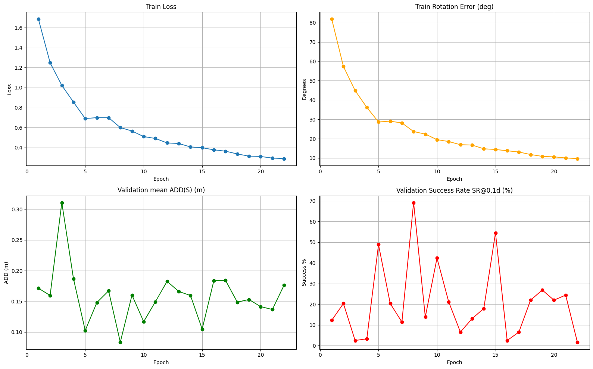
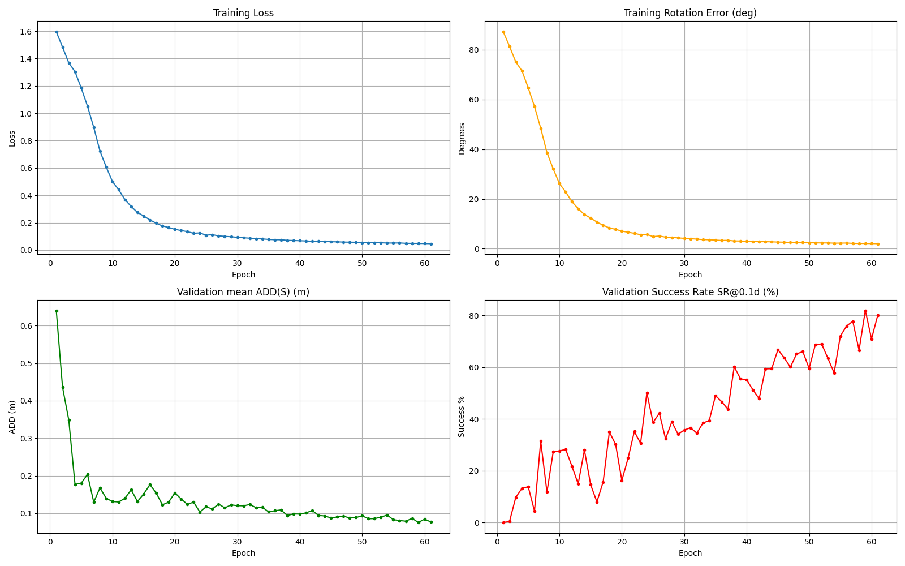
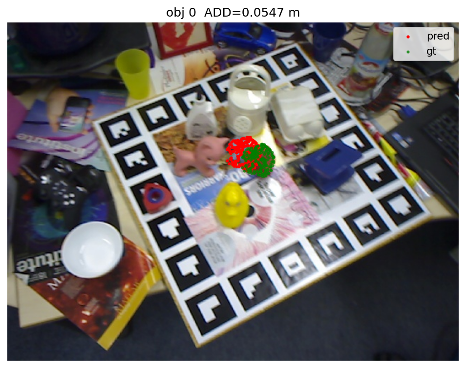
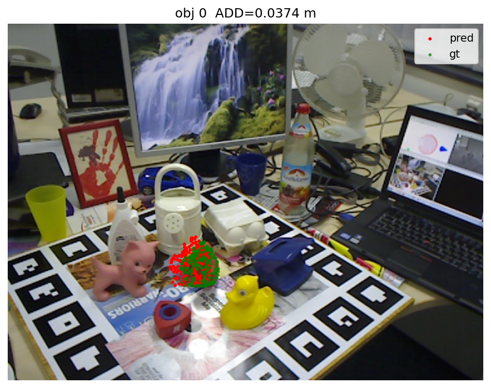
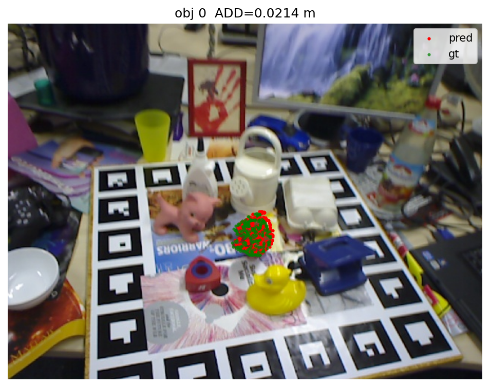
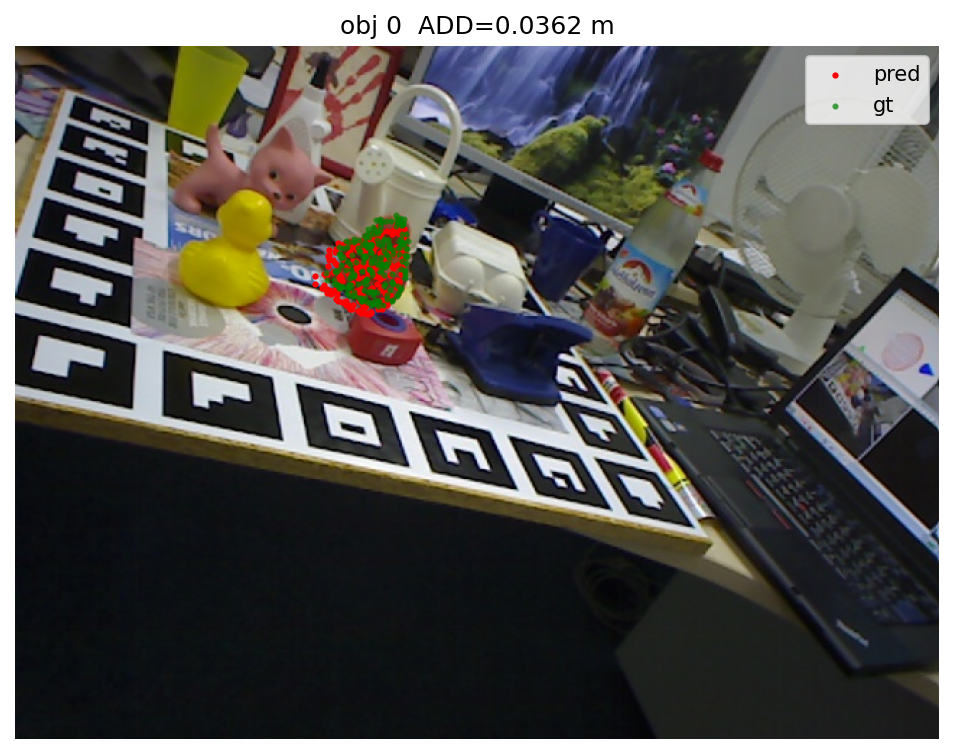
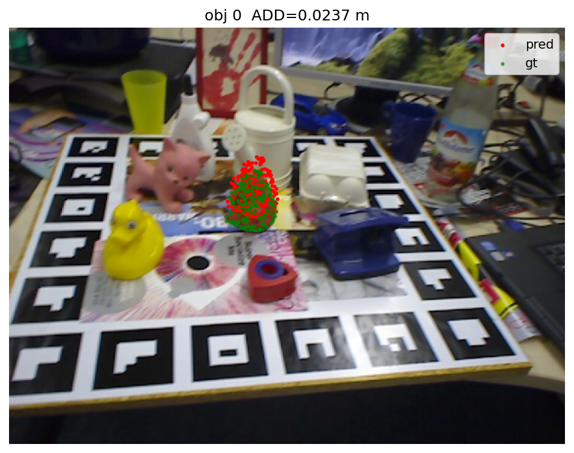
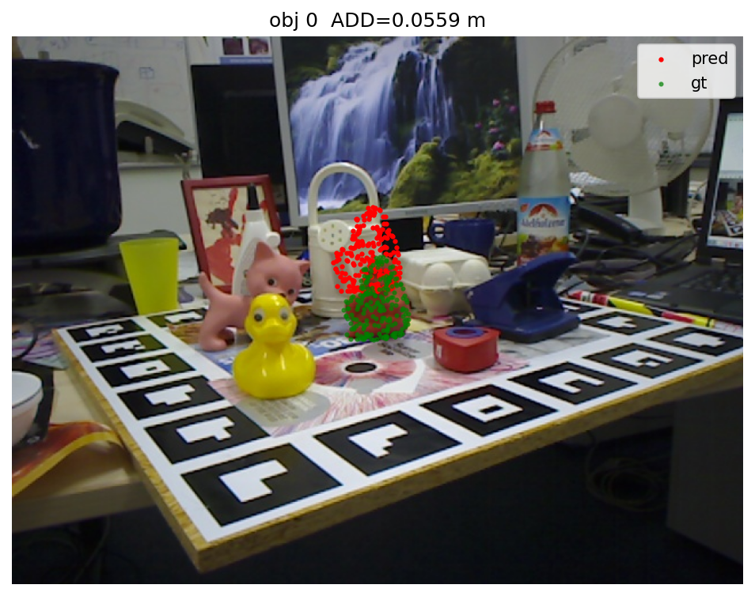
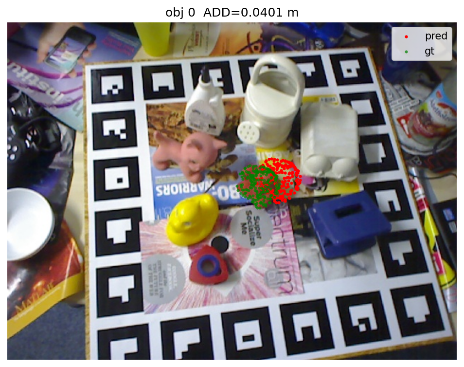

# 🧠 FormerPose: Transformer-based 6D Object Pose Estimation


## 📘 Overview

**FormerPose** is a Transformer-based deep learning model for **6D object pose estimation**, predicting an object’s **3D rotation (R)** and **3D translation (t)** from RGB or RGB-D images.
It uses **multi-scale fusion**, **depthwise separable convolutions**, and **global self-attention** for robust feature extraction.

This repository includes:

* Training FormerPose from scratch
* Evaluating on **single-object** and **multi-object (full dataset)**
* Inference with ADD(S) metric
* Visualization of predicted vs ground-truth object point clouds
* Ready-to-use notebooks & pre-trained checkpoints

---

# 📂 Repository Structure

```
formerPose_implementation/
│
├── notebooks/
│   ├── FormerPose.ipynb
│   ├── FormerPose_v1_2.ipynb
│
├── checkpoints/
│   ├── best.pt          # Best model trained on full dataset
│   ├── last.pt          # Last epoch checkpoint
│
├── results/
│   ├── initial_results.png
│   ├── results_for_single_obj.png
│   ├── results_full_dataset.png
│
├── inference/
│   ├── inference_results.csv
│   ├── viz_10_obj0_add0.0547.png
│   ├── viz_18_obj0_add0.0374.png
│   ├── viz_19_obj0_add0.0214.png
│   ├── viz_34_obj0_add0.0362.png
│   ├── viz_51_obj0_add0.0405.png
│   ├── viz_58_obj0_add0.0237.png
│   ├── viz_71_obj0_add0.0559.png
│   ├── viz_100_obj0_add0.0401.png
│
└── readme.md
```


---
# 🧩 Model Architecture

### ✔ Depthwise Separable Convolutions

Efficient and lightweight local feature extraction.

### ✔ Multi-Scale Fusion

Combines shallow + deep features before attention.

### ✔ Transformer Encoder

Captures long-range spatial dependencies.

### ✔ Pose Regression Head

Outputs:

* **Rotation** (quaternion or SE(3))
* **Translation** (3D vector)

---

# 📚 Training Pipeline

1. **Dataset Loader**

   * RGB, depth, mask loading
   * Back-projection to 3D point cloud
   * Normalization + resizing
   * GT pose generation

2. **Forward Pass**

   * Image → CNN → Transformer → Pose Regression

3. **Loss Functions**

   * Geodesic rotation loss
   * L1 translation loss
   * Optional point-matching loss

4. **Optimizer**

   * AdamW

5. **Validation (every epoch)**

   * Compute **ADD(S)**
   * Compute **[SR@0.1d](mailto:SR@0.1d)**

6. **Logging**

   * Loss curves
   * Rotation / translation curves
   * Validation plots

---

# 📊 Training Results

## **1️⃣ Initial Training Results (Baseline Model)**


---

## **2️⃣ Results for Model Trained on a Single Object**





---

## **3️⃣ Results for Model Trained on the Full LINEMOD Dataset**





---

# 🧪 Inference Results (Qualitative + Quantitative)

The model was evaluated on unseen LINEMOD test frames.
For each frame:

* Green dots = **ground truth point cloud**
* Red dots = **predicted pose-transformed point cloud**
* Title displays ADD(S) error in meters

---

## **Inference Visualizations**

<table>
  <tr>
    <td align="center">
      <br>
      <sub>ADD = 0.0547 m</sub>
    </td>
    <td align="center">
      <br>
      <sub>ADD = 0.0374 m</sub>
    </td>
    <td align="center">
      <br>
      <sub>ADD = 0.0214 m</sub>
    </td>
    <td align="center">
      <br>
      <sub>ADD = 0.0362 m</sub>
    </td>
  </tr>
  <tr>
    <td align="center">
      <br>
      <sub>ADD = 0.0405 m</sub>
    </td>
    <td align="center">
      <br>
      <sub>ADD = 0.0237 m</sub>
    </td>
    <td align="center">
      <br>
      <sub>ADD = 0.0559 m</sub>
    </td>
    <td align="center">
      <br>
      <sub>ADD = 0.0401 m</sub>
    </td>
  </tr>
</table>


---


# 🧪 Results Summary

| Metric                    | Initial Model | Single Object | Full Dataset |
| ------------------------- | ------------- | ------------- | ------------ |
| Training Loss             | ↓             | ↓             | ↓, best      |
| Rotation Error            | Moderate      | Lower         | Lowest       |
| Translation Error         | Moderate      | Lower         | Lowest       |
| ADD(S)                    | Fluctuating   | Stable        | Most stable  |
| [SR@0.1d](mailto:SR@0.1d) | Very low      | Moderate      | Best         |

**Observation:**
Training on the full dataset provides the best generalization and pose accuracy.

---

# 🗂 Pretrained Checkpoints

Place your files in `checkpoints/`:

* `formerpose_best.pt`
* `formerpose_last.pt`


# 🪪 Citation

```
Hou, P., Zhang, Y., Wu, Y., Yan, P., & Zhang, F. (2024). FormerPose: An efficient multi-scale fusion Transformer network based on RGB-D for 6D pose estimation. Journal of Visual Communication and Image Representation, 106, 104346. https://doi.org/10.1016/j.jvcir.2024.104346
```

---

# 🙌 Acknowledgements

Thanks to:

* FormerPose authors
* LINEMOD dataset team
* Faculty & mentors guiding the project
